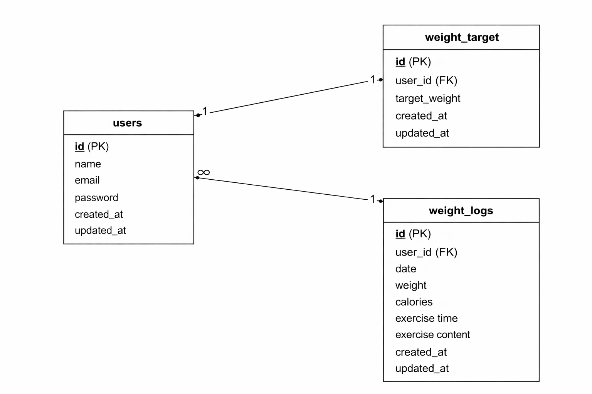

# アプリケーション
Pigry（体重管理アプリ）

## 環境構築

### 1. Docker ビルド
・git clone gitgit@github.com:tsumika0524/Pigry.git 
・DockerDesktopアプリを立ち上げる 
・docker-compose up -d --build

### Laravel環境構築
1.docker-compose exec php bash 
2.composer install 
3.「.env.example」ファイルを 「.env」ファイルに命名を変更。または、新しく.envファイルを作成 
4..envに以下の環境変数を追加 

DB_CONNECTION=mysql 
DB_HOST=mysql 
DB_PORT=3306 
DB_DATABASE=laravel_db 
DB_USERNAME=laravel_user 
DB_PASSWORD=laravel_pass 

5.アプリケーションキーの作成 
php artisan key:generate 
6.マイグレーションの実行 
php artisan migrate 
7.シーディングの実行 
php artisan db:seed 

#### 環境開発URL
・トップページ(管理画面)ːhttp://localhost/weight_logs 
・体重登録ːhttp://localhost/weight_logs/create 
・体重検索ːhttp://localhost/weight_logs/search 
・目標設定ːhttp://localhost/wight_logs/goal_setting 
・会員登録ːhttp://localhost/register/step1 
・初期目標体重登録ːhttp://localhost/register/step2 
・ログインːhttp://localhost/login 

##### 使用技術(実行環境)
・PHP 8.4.13 
・Laravel 8.83.29 
・MySQL 8.0.26  
・nginx 1.21.1  
・jquery 3.7.1.min.js 

######　ER図

